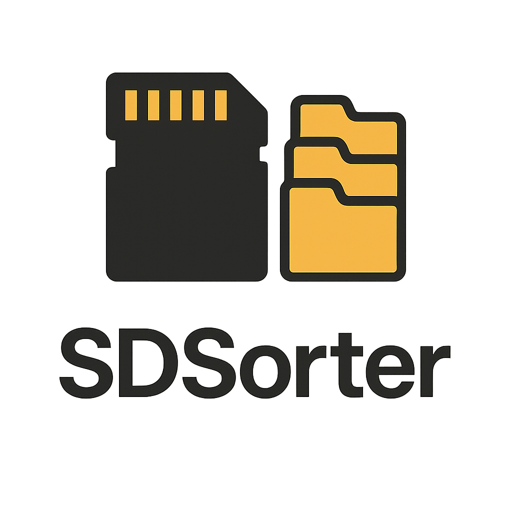

<p align="center">
  
</p>

**Scanner Data Sorter for the SDS100/200 crowd (and beyond).**  
Created by *yung-megafone*

---

## Overview
Uniden SDS radios (and many other recorders) generate **thousands of WAV files** quickly. Managing, organizing, and archiving those recordings by hand is a nightmare — Windows Explorer crawls, and SD cards fill fast.

**SDSorter** automates that pain away.

Point it at your ingest folder or SD card, and it will bucket your recordings into:

```

YYYY/MM/DD/

````

Now with a **full GUI, real-time stats, and dataset analysis tools** — built for people dealing with *hundreds of thousands to millions of files.*

---

## Features

### Core Sorting
- **Fast**: Streaming walker + multi-threaded I/O handles **massive datasets**
- **Safe by default**: **Copy** unless you explicitly enable move
- **Flexible input**: WAV, MP3, M4A — anything timestamp-based
- **Scanner-native**: Supports SDS100/200 filename format (`YYYY-MM-DD_hh-mm-ss.wav`)

### GUI (New)
- **Modern interface** (no CLI required)
- **Progress bar with % + live stats**
- One-click folder selection
- Built-in logging viewer
- Cancel jobs mid-run safely

### Live Progress & Metrics
- Real-time:
  - Files processed
  - Files/sec (true rate, not cumulative)
  - Elapsed time
- Clean layout:
  - % progress next to bar (stable, no UI shifting)
  - Detailed stats shown below

### Analysis Mode (New)
- Scan recording folders without modifying data
- Generate dataset insights:
  - File counts
  - Time distribution
  - Recording density
- Export results to CSV
- Built-in chart visualization

### Reliability
- Handles **millions of files without choking**
- Designed to avoid:
  - Explorer slowdowns
  - UI freezing
  - Memory spikes
- Skip errors and continue processing

---

## Quickstart (CLI)

Dry run (safe preview):
```powershell
python sdsorter.py D:\Ingest E:\Archive --dry-run -v
````

Real copy (NVMe tuned):

```powershell
python sdsorter.py D:\Ingest E:\Archive --workers 6 --skip-errors -v --logfile sort.log
```

Move (destructive — be sure):

```powershell
python sdsorter.py D:\Ingest E:\Archive --move --readonly --workers 4
```

Use file modified time instead:

```powershell
python sdsorter.py D:\Ingest E:\Archive --date-source mtime
```

---

## GUI Usage

Just run:

```bash
python sdsorter.py
```

### Sort Tab

* Select source + destination
* Choose options (move, dry run, etc.)
* Click **Start Sorting**

### Analysis Tab

* Select your recording folder
* Click **Analyze**
* Export CSV or view charts

---

## Options

| Flag            | Description                                        |
| --------------- | -------------------------------------------------- |
| `--move`        | Move instead of copy (destructive across devices). |
| `--dry-run`     | Only log actions, no writes.                       |
| `--readonly`    | Mark destination files read-only.                  |
| `--skip-errors` | Skip problematic files and continue.               |
| `--date-source` | `filename` (default) or `mtime`.                   |
| `--ext`         | Restrict extensions (default: `.wav`).             |
| `--workers`     | Parallel workers (SSD/NVMe: 4–8; HDD: 2–3).        |
| `-v` / `-vv`    | Increase verbosity.                                |
| `-q`            | Quiet mode (errors only).                          |
| `--logfile`     | Tee logs to a file.                                |

---

## Install & Run

Requires Python 3.8+

```bash
pip install tqdm customtkinter matplotlib
```

Run CLI:

```bash
python sdsorter.py SRC_PATH DST_PATH [options]
```

Run GUI:

```bash
python sdsorter.py
```

---

## Who needs this?

* SDS100/200 users drowning in recordings
* SDR / scanner hobbyists archiving long-term
* Data hoarders with **hundreds of thousands to millions of files**
* Anyone who’s ever said:

  > “I’ll sort it later…”

---

## Roadmap

* Channel / department-aware sorting
* SQLite indexing for instant search
* Config profiles
* Standalone executable (no Python required)
* Dark theme polish + UI scaling improvements

---

## Author

Built out of frustration, caffeine, and way too many files by **yung-megafone**

---

## License

MIT — free to use, modify, and improve
