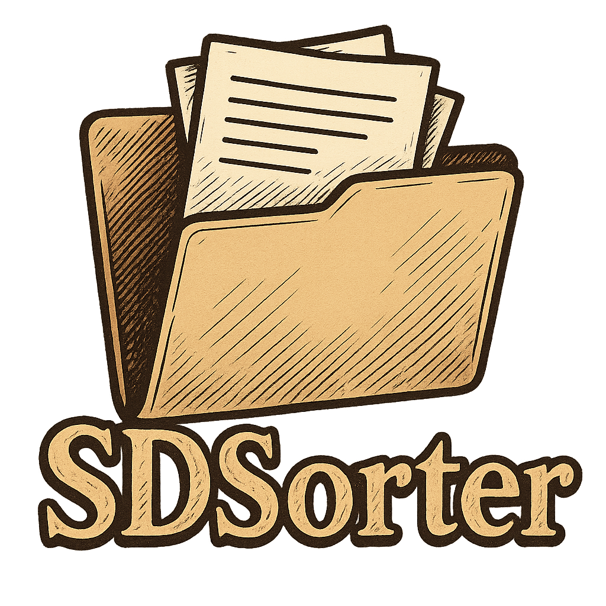

<p align="center">
  
</p>

**Scanner Data Sorter for the SDS100/200 crowd (and beyond).**  
Created by *yung-megafone*.

---

##  Overview
Uniden SDS radios (and many other recorders) generate **thousands of WAV files** quickly. Managing, organizing, and archiving those recordings by hand is a nightmare — Windows Explorer crawls, and SD cards fill fast.

**SDSorter** automates that pain away. Point it at your ingest folder or SD card, and it will bucket your recordings into:

```
YYYY/MM/DD/
```

Optionally, you can extend sorting by metadata, set files read-only, skip errors, and tune performance for HDDs, SSDs, or NVMe drives.

---

## Features
-  **Fast**: Streaming walker + multi-threaded I/O handles **millions of files**.
-  **Safe by default**: **Copy** unless you explicitly pass `--move`.
-  **Progress bars & logs**: See what’s happening live, with optional `--logfile` for audit.
-  **Flexible**: WAV, MP3, M4A — works with any timestamped filename.
-  **Scanner-native**: Supports SDS100/200 filename format (`YYYY-MM-DD_hh-mm-ss.wav`).
-  **Future-proof**: optional channel/department sorting, SQLite indexing, GUI (planned).

---

##  Quickstart

Dry run (safe preview):
```powershell
python sdsorter.py D:\Ingest E:\Archive --dry-run -v
```

Real copy, NVMe tuned:
```powershell
python sdsorter.py D:\Ingest E:\Archive --workers 6 --skip-errors -v --logfile sort.log
```

Move (destructive across devices, only if you’re sure):
```powershell
python sdsorter.py D:\Ingest E:\Archive --move --readonly --workers 4
```

Use file modified time instead of filename date:
```powershell
python sdsorter.py D:\Ingest E:\Archive --date-source mtime
```

---

##  Options

| Flag            | Description |
|-----------------|-------------|
| `--move`        | Move instead of copy (destructive across devices). |
| `--dry-run`     | Only log actions, no writes. |
| `--readonly`    | Mark destination files read-only. |
| `--skip-errors` | Skip problematic files and continue. |
| `--date-source` | Choose date detection: `filename` (default) or `mtime`. |
| `--ext`         | Restrict to extensions (default: `.wav`). Repeatable. |
| `--workers`     | Parallel workers (SSD/NVMe: 4–8; HDD: 2–3). |
| `-v` / `-vv`    | Increase verbosity. |
| `-q`            | Quiet mode (errors only). |
| `--logfile`     | Tee logs to a file. |

---

##  Install & Run
Requires Python 3.8+ and [tqdm](https://pypi.org/project/tqdm/) (for progress bars).

```bash
pip install tqdm
```

Run directly:
```bash
python sdsorter.py SRC_PATH DST_PATH [options]
```

---

##  Who needs this?
- SDS100/200 users with SD cards full of recordings.
- Datahoarders with **hundreds of thousands of files**.
- Anyone who’s ever said: *“How do I sort my million-record database?”*

**Answer:** SDS! 

---

##  Roadmap
- Department/Channel-level sorting (via filename or tags).
- SQLite/CSV index export for quick searches.
- Simple GUI wrapper.
- Cross-platform packaging (Windows/Linux binaries).

---

##  Author
Built with frustration, caffeine, and way too many files by **yung-megafone**.

---

##  License
MIT — free to use, hack, and improve. Give credit where due.


